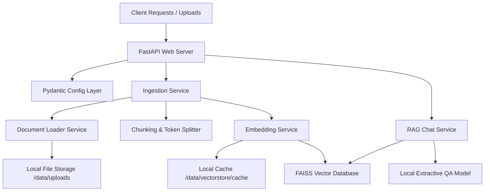

# AI Knowledge Assistant (RAG System Backend)

This document provides a comprehensive overview of the backend architecture, directory layout, design choices, and best practices.

---

## 1. System Architecture Overview

The system is designed following modular principles to separate orchestration, ingestion, vector operations, and API layers.

### Architectural Diagram



### Components Interaction Details
1. **FastAPI Web Server**: Serves as the API interface. Requests are parsed using Pydantic schemas. Standardized responses are returned, and all uncaught or custom application exceptions are handled at a global layer.
2. **Configuration (`pydantic-settings`)**: Loads variables from environmental files (`.env`), parses them into correct types, and executes validation rules at runtime bootstrap.
3. **Structured Logging**: Pre-configured standard Python logging output streams redirect system health and pipeline stages to standard outputs with precise timestamps.

---

## 2. Directory Layout & Setup Files

Here is the folder structure created for the project workspace:

```
RAG_System/
│
├── app/
│   ├── api/
│   │   ├── deps.py               # FastAPI Dependency Providers
│   │   └── v1/
│   │       ├── endpoints/
│   │       │   ├── chat.py       # Session Conversational Chat Endpoints
│   │       │   └── document.py   # Document Ingestion & Search Endpoints
│   │       └── router.py         # Master Route Grouping
│   │
│   ├── core/
│   │   ├── config.py             # Pydantic Settings Validation
│   │   ├── exceptions.py         # Centralized Exception Handler
│   │   └── logging.py            # Structured Application Logger
│   │
│   ├── models/
│   │   └── schemas.py            # Pydantic Request/Response Models
│   │
│   ├── services/
│   │   ├── chunking.py           # tiktoken text splitter service
│   │   ├── document_loader.py    # Multi-format File parsing service
│   │   ├── embeddings.py         # Local Hashing & OpenAI Embeddings
│   │   ├── ml_model.py           # Local Extractive QA Model
│   │   ├── rag_service.py        # Conversational Memory coordinator
│   │   └── vectorstore.py        # FAISS Persistent Store / Chroma stub
│   │
│   └── main.py                   # FastAPI Application Bootstrap
│
├── data/                         # Upload and Vector Store Persistent Directories
├── docs/                         # Walkthroughs and system guides
├── tests/
│   └── test_pipeline.py          # End-to-end integration tests
│
├── .dockerignore
├── .env.example
├── requirements.txt
├── Dockerfile
├── docker-compose.yml
└── README.md
```

---

## 3. Best Practices & Common Mistakes

### Best Practices
* **Pydantic Settings**: Avoid hardcoding environment variable queries using `os.getenv()`. Pydantic Settings validates that crucial config are correct during startup rather than throwing a runtime `KeyError` mid-execution.
* **Coreference Query Expansion**: When a follow-up query references pronouns like "it", retrieve noun-keywords from the last turn and append them to context-search to ensure proper semantic search matching.
* **Deterministic Hashing**: For local offline embeddings, use MD5 features hashing on numpy arrays to avoid startup randomization of Python's default `hash()`, preserving vector mapping between restarts.
* **Global Exception Filters**: Avoid using unstructured try-except blocks inside API route handlers. Handle exceptions at a centralized middleware or app exception-handler layer to guarantee clients always receive uniform JSON schemas.

### Common Mistakes
* **OOM from Conversational Memory**: Storing session chat logs indefinitely in memory without bounding history length. We limit active histories to the last 20 messages.
* **Unresolved Native Dependencies**: Containerizing vector store dependencies (like FAISS) without installing compile libraries (like `libgomp1` on Debian) which leads to container startup crashes.
* **Missing Directory Paths**: Not checking if target directories (like `/data/uploads`) exist before writing files, causing raw `FileNotFoundError` during disk I/O.

---

## 4. Run & Test Instructions

### Running Local Integration Tests
Run the verification test suite locally:
```powershell
.venv\Scripts\python tests/test_pipeline.py
```

### Running with Docker Compose
1. Build and boot the services in the background:
   ```bash
   docker-compose up --build -d
   ```
2. Monitor server logs:
   ```bash
   docker logs -f rag_assistant_api
   ```
3. Test the Swagger interactive API docs:
   Browse to `http://localhost:8000/docs`
